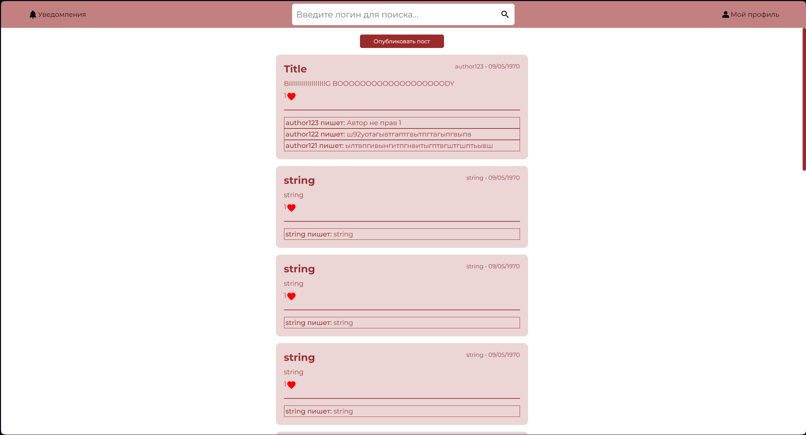
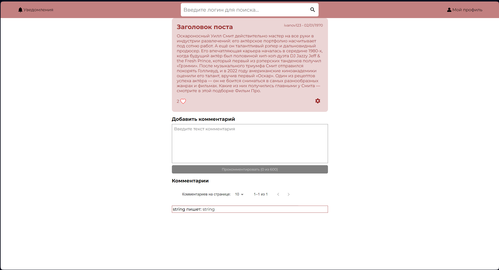
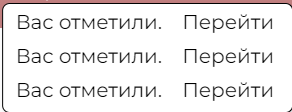

== Макет дизайна frontend - части 

=== Основные страницы

.Страница логина
image::assets/login.png[]

.Страница регистрации
image::assets/register.png[]

.Страница ньюс фида

.Страница собственного профиля
image::assets/my-profile.png[]

.Страница чужого профиля
image::assets/other-profile.png[]

.Страница поста

=== Всплывающие окна

.Создание нового поста

.Изменение поста

.Изменение информации в профиле

.Уведомления

.Поиск
